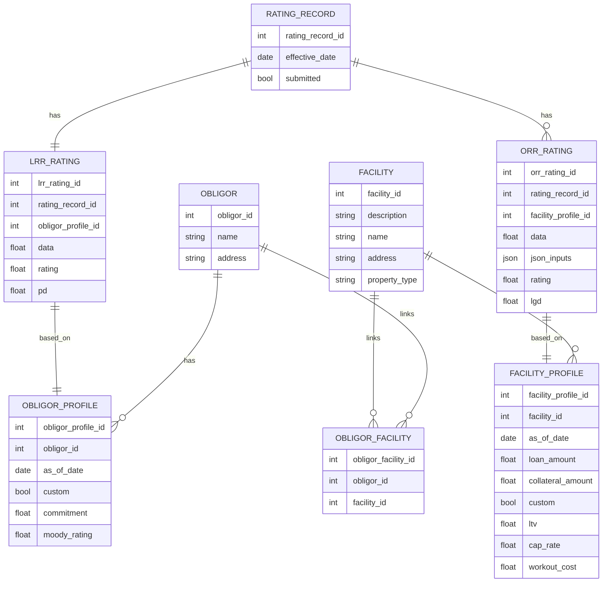

Additional Constraints:

## Model description

I have a relational data model for a credit risk system. Here's the schema I want to model:

- **Obligor**: A legal entity. Each obligor can have multiple profiles over time (OBLIGOR_PROFILE).
    
- **Facility**: A credit facility. Facilities can be associated with one or more obligors, and vice versa — it's a many-to-many relationship via a join table (OBLIGOR_FACILITY).
    
- **Facility Profile**: A snapshot/state of a facility at a point in time. Each facility can have multiple profiles (FACILITY_PROFILE), and each profile can have a history (FACILITY_PROFILE_HISTORY).
    
- **Rating Record**: A record of one or more risk ratings assigned at a point in time. A RATING_RECORD can include:
    
    - One **LRR ratings**, each based on an OBLIGOR_PROFILE.
        
    - One or more **ORR ratings**, each based on a FACILITY_PROFILE.
        

Here are the entity relationships:

- OBLIGOR 1:N OBLIGOR_PROFILE
    
- FACILITY 1:N FACILITY_PROFILE
    
- FACILITY_PROFILE 1:N FACILITY_PROFILE_HISTORY
    
- OBLIGOR M:N FACILITY (via OBLIGOR_FACILITY)
    
- RATING_RECORD 1:1 LRR_RATING (each links to one OBLIGOR_PROFILE)
    
- RATING_RECORD 1:N ORR_RATING (each links to one FACILITY_PROFILE)
    

1. ORR_RATING and LRR_RATING have rating_records but they must be tied to the same obligor.
2. There can only be one ORR Rating per rating record  
3. There can be many LRR ratings per rating records

## FastAPI endpoints

Create FastAPI endpoints to manipulate the database.

# USE 

1. Scqalchemy orm 
2. pydantic models
5. fastapi endpoints

# populate db 

1. 100 obligors
2. 2 facility per obligor
3. for M:N relation of facility obligir have 10 obligors that will share 2 facilities
4. 5  borrower profiles
5. 5 facility profiles
 

